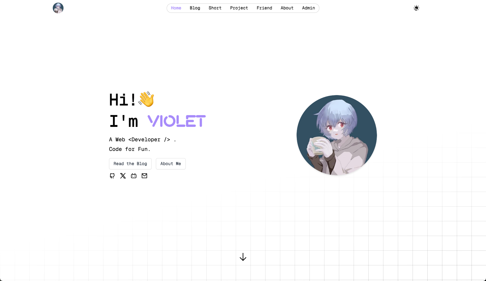
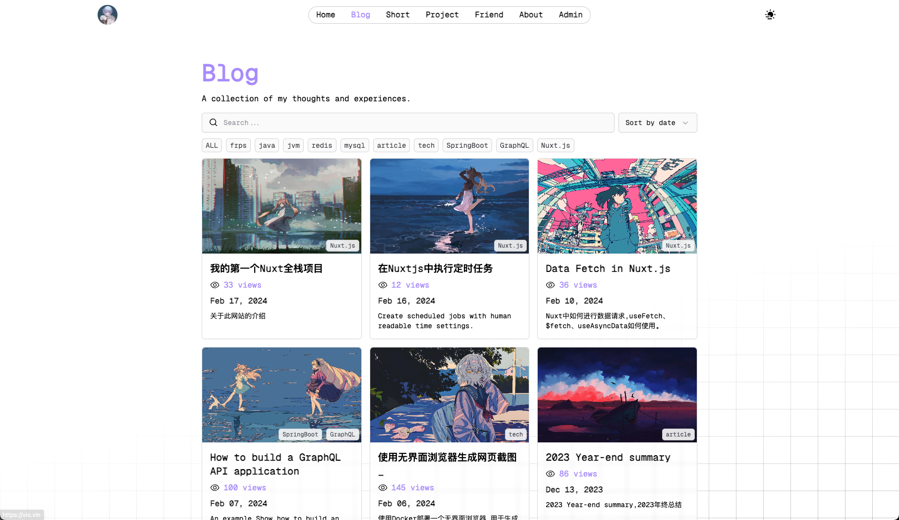
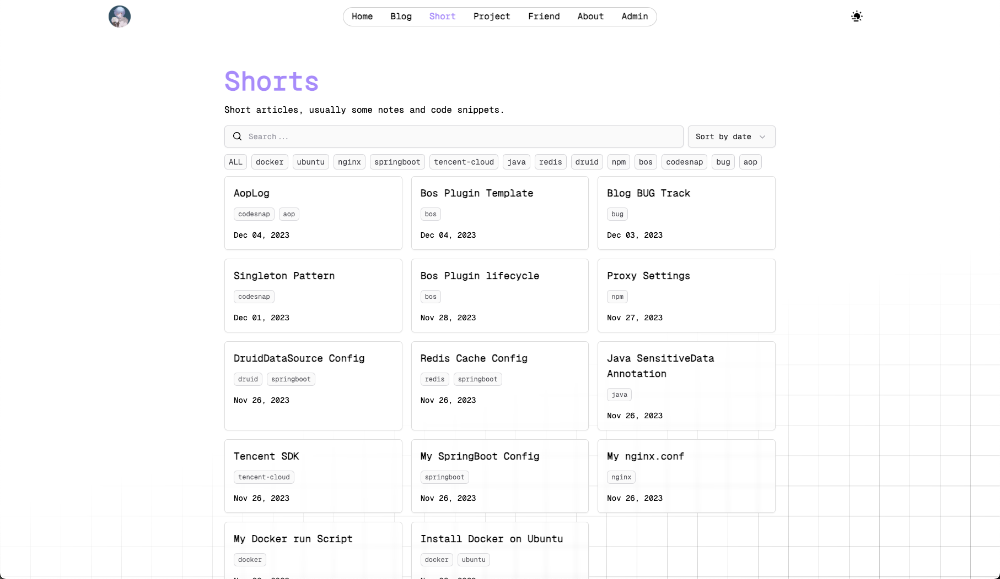
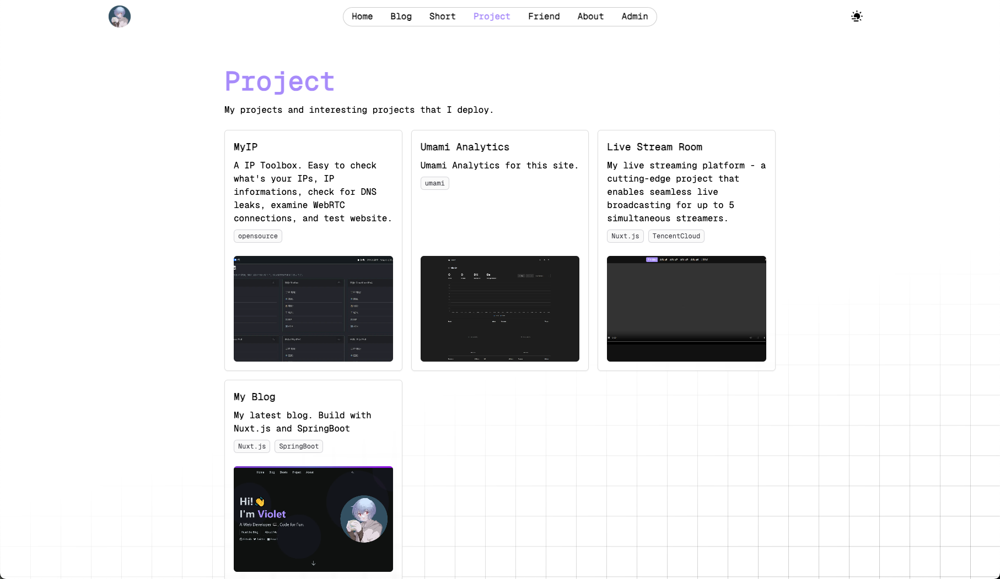
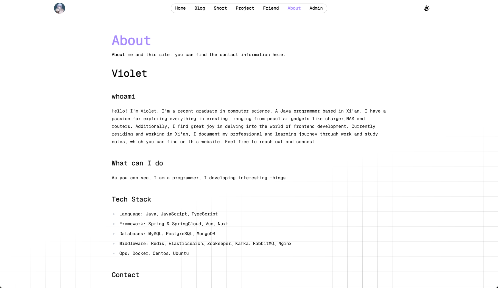
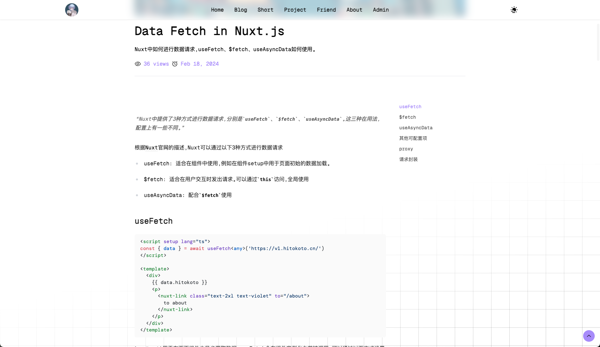
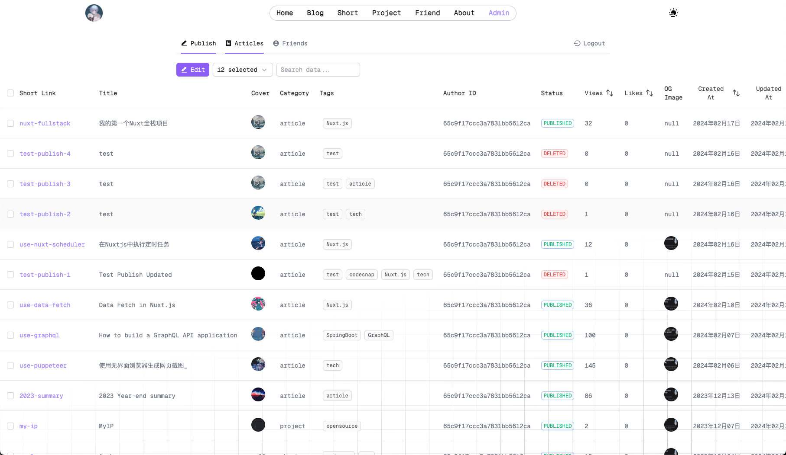
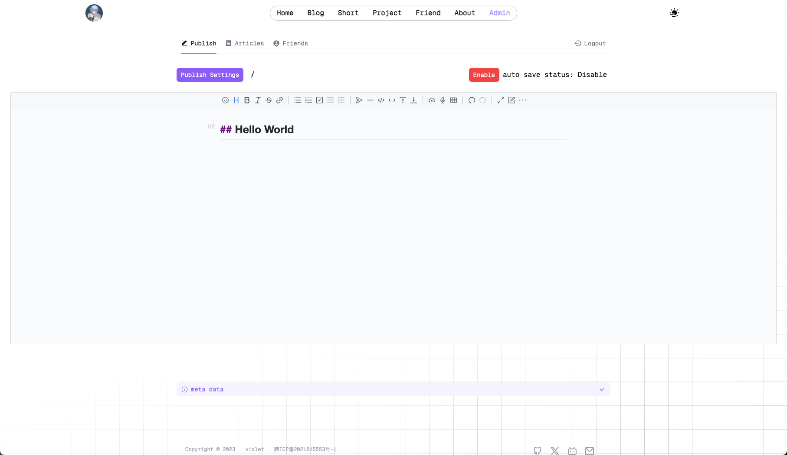

## 预览

首页


Blog


Short


Project


Friend


About


Article


Admin


Editor


## 前言

> 我的上个网站使用的技术栈是 Vue + SpringBoot，使用了一年多的时间，后来由于 SPA 前端对于 SEO 的效果不是很好，于是我决定开发第二代。

> 相比于最初的版本，数据库使用了 MySQL，新项目，我想尝试不同的技术栈，于是便使用了 MongoDB，但是就开发上来说，两者并没有什么差别。前端则是在很早之前就决定使用 Nuxtjs。

> **为什么后期又改称了 Nuxt 全栈项目？**
>
> 主要是服务器成本问题，此次项目的部署方式是 Paas，所有服务均以容器化的形式部署在 Zeabur，一个按量计费的 Paas 平台，如果使用前后端分离的模式，需要部署 5 个容器，分别是：MongoDB，SpringBoot，Nuxt，ScreenShot（一个给网页截图的工具，具体可以看[这篇介绍](https://vio.vin/article/use-puppeteer)）,Redis（用了一段时间之后去掉了，Redis 主要用来做接口限流和数据缓存，由于数据缓存这块内容，没有使用任何框架，纯手动操作 Redis，导致有很多缓存和实际数据不同步的情况，又需要通过定时任务来同步数据，最主要的是，网站数据量不大，加不加缓存接口响应时间相差不大，所以后期去掉了 Redis）。按照每 GB 内存没分钟 0.00023 刀来计算，每个月超不多会产生 10 刀的服务器成本，于是便有了精简结构，改成 Nuxt 全栈项目的想法。

> 从开始改造到结束总共花了 5-6 天时间，其中接口方面几乎没遇到什么困难，唯一遇到的问题出在文件上传上，我对于 Node 环境下的文件操作不熟悉，起初文件以二进制的格式传到后端，之后需要调用 Cloudflare Works 上传到 Clouflare R2 存储桶，我一直不不知道为啥，上传之后的文件格式仍然是二进制，请求返回的内容是一堆数字。折麽了一天之后，改成使用 Amazon S3 的上传 API 上传，问题得以解决。

## 技术栈

主要：

-   Nuxt：主框架
-   MongoDB：数据存储
-   Cloudflare R2：图片存储
-   Giscus：评论系统
-   NuxtUI：UI 框架

其他

-   vditor：Makrdown 编辑器
-   Markdown-It：Markdown 文本转 HTML
-   Tocbot：文章目录生成
-   vue-use-fixed-header：网站 Header
-   pinia/nuxt：前端数据缓存
-   unocss：CSS 框架
-   async-validator：数据校验
-   nuxt-mongoose：数据库连接
-   nuxt-scheduler：定时任务
-   shikiji：代码高亮
-   @nuxtseo/module：SEO 优化
-   @nuxtjs/color-mode：主题切换

## 功能

除了你所能看到的页面之外，还有以下小功能：

-   全文搜索


-   复制选中的文字


-   集成管理功能


-   生成友链网站截图


-   所见即所得的在线编辑器


## 本地运行

-   你需要 Fork 这个仓库的**zeabur-mongo**分支

```
https://github.com/lnbiuc/blog-next-view
```

-   clone 你 Fork 的仓库
-   添加环境变量

复制一份`.env`文件，重命名为`.env.local`

```
# 数据库连接URI
MONGODB_URI=${MY_MONGODB_URI}
# 图片浏览地址，最后不要加/
IMAGE_PREVIEW_URI=${IMAGE_PREVIEW_URI}
# 网页截图地址，最后不要加/
SCREEN_URL=${SCREEN_URL}

# Cloudflare文件上传地址
R2_UPLOAD_ENDPOINT=${R2_UPLOAD_ENDPOINT}
# ACCESS_ID
AWS_ACCESS_KEY_ID=${AWS_ACCESS_KEY_ID}
# SECRET_KEY
AWS_SECRET_ACCESS_KEY=${AWS_SECRET_ACCESS_KEY}
# 存储桶名称
R2_BUCKET_NAME=${R2_BUCKET_NAME}

```

-   安装依赖运行

```shell
pnpm i
pnpm dev
```

## 如何部署

-   在 Zeabur 创建 Project
-   创建数据库实例


-   新建服务，使用 Git 仓库，选择刚才 Fork 的仓库
-   设置环境变量


-   设置域名


-   CDN

设置回源地址到你上一步设置的域名即可，推荐设置缓存时间为 2 小时

## Changlog

-   2024-02-18：
    -   登陆生成 token，数据库更新校验 token
    -   更新依赖

## 其他问题请评论
